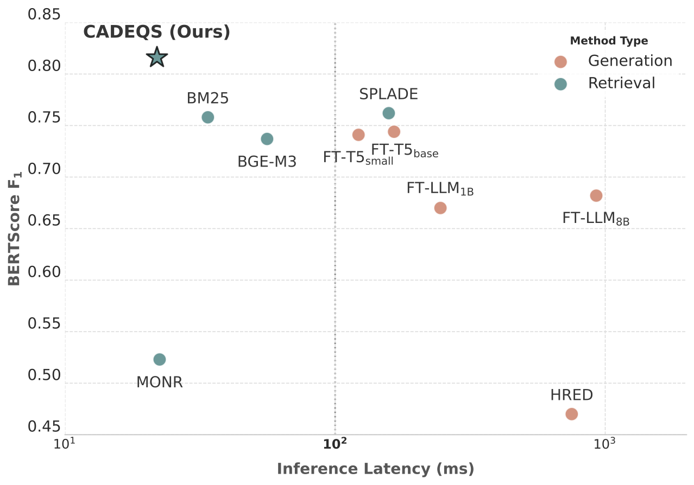

# CADEQS
 
This repository contains materials developed by LY Corporation and is temporarily open-sourced as the official implementation of our SIGIR 2026 paper.
 
- **Temporary Release**: This repository is temporarily available as open-source. Therefore this repository may be turn into read-only or private anytime.
- **Attribution**: All code and materials in this repository are owned by LY Corporation.
 

## Project Overview

This repository is the official implementation of our SIGIR 2026 paper:
**"Recasting Web-Scale Query Suggestion as Dense Retrieval: Efficient, Up-to-Date, and Context-Aware Suggestions."**

In this work, we reframe web-scale query suggestion as **dense retrieval** (instead of generation) to jointly address three practical requirements: **low latency**, **reflection of evolving information**, and **session context awareness**.

The repository includes our proposed method **CADEQS (Context-aware Asymmetric Dual Encoder for Query Suggestion)**, along with data preprocessing, evaluation scripts, and baseline implementations.
The method is referred to as **CADE-QS** in the SIGIR 2026 paper.




If you use this repository, please cite:

```bibtex
@inproceedings{recasting_qs_sigir2026,
  title     = {Recasting Web-Scale Query Suggestion as dense retrieval: Efficient, Up-to-Date, and Context-Aware Suggestions},
  author    = {Nishikawa, Sosuke and Yoshinaga, Naoki and Kaji, Nobuhiro},
  booktitle = {Proceedings of the 49th International ACM SIGIR Conference on Research and Development in Information Retrieval},
  year      = {2026},
  publisher = {Association for Computing Machinery},
  series = {SIGIR '26}
}
```

## Installation and Usage

#### Installation

Python **3.10+** required.

```bash
pip install -e .
```

For `baselines/llm`, install vLLM separately according to your environment:
https://docs.vllm.ai/en/latest/getting_started/installation/

#### Usage

Run a CADEQS pipeline on AOL-stle query logs:

```bash
# 1) Preprocess AOL-style logs
# src_dir should contain files like:
#   user-ct-test-collection-01.txt.gz
#   ...
python data/preprocess.py \
  --src_dir /path/to/aol-user-ct-collection \
  --output_dir /tmp/qs_aol

# 2) Prune query encoder (first + last two layers)
python -m cadeqs.prune \
  --model_name_or_path MiniLMv2-L6-H768-distilled-from-BERT-Base \
  --output_dir /tmp/qs_aol/query_encoder_pruned

# 3) Train CADEQS
python -m cadeqs.train \
  --model_name_or_path /tmp/qs_aol/query_encoder_pruned \
  --candidate_model_name_or_path MiniLMv2-L6-H768-distilled-from-BERT-Base \
  --train_file /tmp/qs_aol/train.jsonl \
  --output_dir /tmp/qs_aol/cade_qs_model

# 4) CADEQS inference
python -m cadeqs.infer \
  --query_encoder_path /tmp/qs_aol/cade_qs_model/query_encoder \
  --candidate_encoder_path /tmp/qs_aol/cade_qs_model/candidate_encoder \
  --corpus_path /tmp/qs_aol/inventory.jsonl \
  --test_file /tmp/qs_aol/test.jsonl \
  --output_file /tmp/qs_aol/cade_qs_predictions.jsonl \
  --index_path /tmp/qs_aol/cade_qs_faiss.index

# 5) BERT Score evaluation
python -m evaluation.evaluate \
  --bert-evaluator microsoft/deberta-large \
  --input /tmp/qs_aol/cade_qs_predictions.jsonl \
  --metrics bert_score \
  --output /tmp/qs_aol/cade_qs_predictions_eval.jsonl
```

For baseline implementations and usage examples, see [baselines/README.md](baselines/README.md).

## Contributions
 
As this project is temporarily open-sourced, we are not accepting contributions. For feedback or inquiries, please open an issue in this repository.

## License
 
This code is dedicated to the public domain under [CC0 1.0](https://creativecommons.org/publicdomain/zero/1.0/). 
You may copy, modify, and distribute it without restriction, and the authors make no warranties or guarantees regarding its use.
